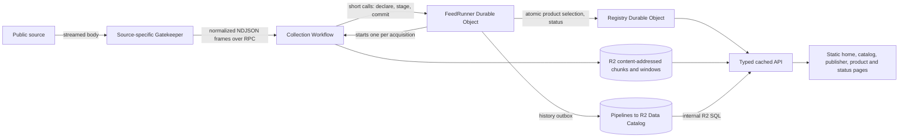

# open-data.pt

A Cloudflare-based platform that collects Portuguese public data, normalizes it at source-specific boundaries, keeps meaningful event and series history, and publishes cacheable JSON products and a static web catalog.

The API is intentionally unversioned while the platform is in development. Breaking changes are made in place; there is no legacy protocol or storage compatibility layer.

## Application

- Catalog: <https://open-data.pt>
- Product pages: <https://open-data.pt/product/?slug=carris-vehicles-current>
- Status: <https://open-data.pt/status/>
- API reference: <https://open-data.pt/docs>
- OpenAPI: <https://open-data.pt/openapi.json>
- MCP server: <https://open-data.pt/mcp>, for AI assistants. Built with Cloudflare Code Mode (`apps/kernel/src/mcp.ts`): a `search` tool over the OpenAPI document and an `execute` tool against the API, each run in a Dynamic Worker with no network access.

The pages come from `apps/site`, a Vite and React build on Cloudflare's Kumo components; `pnpm build:site` writes them to `apps/site/dist`, which the kernel serves as static assets, and `pnpm deploy:kernel` builds them first. They fetch on initial load, explicit refresh, and visibility restoration. They do not open WebSockets or continuously poll.

## Architecture



### Gatekeepers

One Worker per catalog topic, each separately deployable and reached only through a private service binding. A topic is what the data is about, never who publishes it or how. A feed runs in the Worker of its first topic, and the Workers are generated: every library declares in `worker.ts` the vars, secrets, buckets and CPU limit it needs, and `pnpm packages:sync` writes each `packages/gatekeeper-<topic>/` with the libraries its feeds use. Today:

| Worker        | Libraries                               |
| ------------- | --------------------------------------- |
| `cities`      | ArcGIS, CKAN, uData                     |
| `economy`     | BPstat, Eurostat, INE                   |
| `energy`      | DGEG, Eurostat, OMIE, Opendatasoft, REN |
| `environment` | ArcGIS, IPMA, OGC                       |
| `government`  | Parliament, uData                       |
| `health`      | Opendatasoft, uData                     |
| `mobility`    | Carris, GBFS, GTFS, INE, Metro Lisboa   |
| `society`     | INE, OGC, uData                         |
| `telecom`     | INE, PeeringDB (held), RIPEstat (held)  |

A Worker holds no parsing. It wires shared libraries — a format library for anything with a standard (ArcGIS, CKAN, Opendatasoft, GTFS, GBFS, uData, OGC API Features) and a source library per bespoke API (Carris, Metro Lisboa, IPMA, DGEG, INE, REN, OMIE, BPstat, Eurostat, Parliament, RIPEstat, PeeringDB) — hands each the vars and secrets it needs, and lists the example feeds it owns. Every feed's configuration names its library in `source`, and that key is what routes it.

The RPC has five operations: `describe`, `listFeedKinds`, `resolveFeed`, `collect`, and `exampleFeeds`. `collect` returns a typed unchanged, batch, exhausted, or failure result. A batch is one `open-data-normalized/4` NDJSON stream: a header, product-keyed record and point frames, and a mandatory completion frame that may finalize values only known at the end (inferred schema, watermark, a product found absent). Adapters hand the shared collector a typed source fetch; formats that can be read row by row (CSV, NDJSON, JSON arrays, GeoJSON features, GTFS ZIP entries) stream, and everything else is buffered under a 16 MiB cap. Source bodies never leave the Gatekeeper.

### Source publication review

Source access, validation and permission to republish are separate checks. The RIPEstat and PeeringDB libraries are wired into `telecom`, but their examples stay out of its example list until the explicit holds in [`packages/gatekeeper-shared/src/publication-holds.json`](packages/gatekeeper-shared/src/publication-holds.json) are resolved. The consistency tests require every library to be wired into a Worker, every example to name a catalog topic first, and no held example to be auto-published.

A successful source request is not proof of a reuse licence, and a successful dry-run is not a deployment.

### Collection

Each FeedRunner owns one feed's schedule and state, and starts one Workflow instance per acquisition. Waiting on sources, R2 and Pipelines is billed as Workflow CPU and steps, not Durable Object duration. A runner has no idle wake-up: its alarm is the next thing it has to do, so a weekly feed sleeps for a week. The Workflow consumes the stream frame by frame with bounded memory:

1. The runner binds the batch's products to durable slugs and versions.
2. Record products up to 20,000 rows are compared in memory against the rows they currently serve; larger products are compared chunk by chunk against a SQLite entity index in the runner, which writes only changed rows.
3. Changed products are served from content-addressed chunks, listed in order on the product's index entry. Rows are ordered by entity key and chunks end where a key's hash says so, so one change rewrites one chunk and unchanged chunks are never uploaded again.
4. Meaningful revisions become history rows in a runner outbox, about one megabyte per SQLite row.
5. One transaction applies staged entity changes, commits the outbox, and advances the checkpoint. The Registry then selects every current product of the feed at once; publication is retried until it succeeds.
6. When the collection committed history, the Workflow delivers the outbox to Pipelines; whatever it leaves behind, the runner's alarm drains ten minutes later.

A collection that fails before commit leaves nothing behind and is retried from the source. Permanent failures, and three consecutive executor interruptions (memory or CPU kills), put the feed in a cooldown (6 hours, doubling to 48) after which the same acquisition retries by itself; a gatekeeper update that changes the feed clears the cooldown at once. Nobody has to resume anything. Undelivered history is visible as the feed's `historyBacklog`; new collections pause above the kernel's backlog budget, and accepted history is never deleted to relieve pressure.

### Storage

- **Durable Object SQLite:** feed definitions, policies, the product index with each record product's chunk list, status and recent activity (Registry); schedule, checkpoint, product entries, the entity index of large products, staged changes, the history outbox and acquisitions (each FeedRunner).
- **R2 `open-data-pt-data`:** content-addressed record chunks and bounded series and change windows. Only the selected version is served: whatever the previous version referenced and the new one does not is deleted an hour later.
- **R2 Data Catalog:** durable `open_data.records` and `open_data.points` revision history written through Pipelines, partitioned by ingest day, with compaction enabled.

There is no raw source archive, no pending-batch store, no acquisitions history table, and no application usage ledger.

### History and backfill

Gatekeepers with a source-supported history capability use the same `collect` operation with a history cursor. Backfill slices go to the lake only, are paced per source, persist their cursor, keep knowledge time distinct from event time, and never change current serving.

Public history is typed and requires bounded UTC intervals (at most 366 days):

- `GET /api/products/:slug/events?from=&to=&knownAt=&cursor=`
- `GET /api/products/:slug/changes/range?from=&to=&cursor=`
- `GET /api/products/:slug/series/range?from=&to=&seriesKey=&cursor=`

Queries skip ingest-day partitions before the window whenever that is safe (knowledge-time ranges, and event or observation feeds). Windows that ended more than an hour ago are cached at the edge for a day. Responses include an opaque `nextCursor`, freshness, and explicit coverage. There is no anonymous arbitrary-SQL endpoint.

A daily Registry audit compares a sample of yesterday's committed history row counts with the lake; the result is logged as a `lake_audit` event, and a mismatch or a failed check as an error.

## Public API

All endpoints live under `/api`.

| Method | Path                                       | Purpose                                                                                                         |
| ------ | ------------------------------------------ | --------------------------------------------------------------------------------------------------------------- |
| `GET`  | `/api/products`, `/api/products/:slug`     | Public product catalog and metadata                                                                             |
| `GET`  | `/api/products/:slug/records`              | Current records with cursor pagination                                                                          |
| `GET`  | `/api/products/:slug/records/all`          | Every current record in one streamed response                                                                   |
| `GET`  | `/api/products/:slug/series`               | Current bounded series window                                                                                   |
| `GET`  | `/api/products/:slug/changes`              | Recent bounded changes                                                                                          |
| `GET`  | `/api/products/:slug/series/changes`       | Recent series corrections                                                                                       |
| `GET`  | `/api/products/:slug/events`               | Applicable event revisions in a bounded interval                                                                |
| `GET`  | `/api/products/:slug/changes/range`        | Durable changes in a bounded knowledge-time interval                                                            |
| `GET`  | `/api/products/:slug/series/range`         | Durable deduplicated series points in a bounded interval; `knownAt` answers what was known then                 |
| `GET`  | `/api/products/:slug/series/changes/range` | Series point revisions (new points and corrections) ingested in a bounded interval                              |
| `GET`  | `/api/products/:slug.geojson`              | Current geospatial records as streamed GeoJSON                                                                  |
| `GET`  | `/api/catalog.dcat.json`                   | DCAT 3 JSON-LD catalog                                                                                          |
| `GET`  | `/api/feeds`, `/api/feeds/:id`             | Where each dataset comes from: publisher, source, format, cadence and freshness                                 |
| `GET`  | `/api/acquisitions?feedId=&day=`           | Collection runs, newest first, or every run of one UTC day                                                      |
| `GET`  | `/api/outages?days=`                       | When each feed's live collection kept failing, and when the platform collected nothing (the status page's bars) |

The API is read-only: every other method answers `405`. `/records` accepts `where=field:value` (up to five) and, for located products, `bbox=minLon,minLat,maxLon,maxLat`. Unknown query parameters answer `400`, and requests are rate limited per client (`429` with `Retry-After`). A product's current data is cached at the edge for a quarter of its feed's cadence, between 15 seconds and five minutes; the product states its `cadenceSeconds`, `licence` and `attribution`.

## Local development

```bash
pnpm install
pnpm types
pnpm dev                 # the kernel and every Gatekeeper
pnpm dev -- mobility     # the kernel and one of them
```

Nothing has to be installed by hand: the Registry installs every Gatekeeper's examples on its first alarm and keeps them in sync, a few feeds per alarm, re-checking every 15 minutes. A Gatekeeper the kernel is bound to but that is not running logs `gatekeeper_unavailable` and is skipped, so a single-Worker session installs that Worker's feeds and leaves the rest alone.

`CONTRIBUTING.md` is the guide to adding a dataset, a source or a format; `AGENTS.md` is the same for coding agents.

## Validation

```bash
pnpm check
```

This runs Oxlint, generated-binding checks, strict TypeScript, unit and Worker-runtime tests (including a real Workflow collection), and dry-run bundles for the kernel and every Gatekeeper. On a small machine run the steps one at a time instead (`pnpm lint`, `pnpm types:check`, `pnpm typecheck`, `pnpm exec vitest run --maxWorkers=2`, `pnpm deploy:dry-run`). `pnpm packages:sync` regenerates the topic Workers, the root scripts and the kernel's service bindings from the libraries and their examples; a test fails when they drift. A scale benchmark runs on demand:

```bash
SCALE_ROWS=1000000 npx vitest run tests/scale.test.ts
```

Phase 0 consumption measurements come from `node tools/usage-report.ts --days 7` (read-only GraphQL Analytics).

## Deployment

Provisioning and deployment are explicit actions; this repository does not alter production resources on its own. For an approved deployment:

```bash
CATALOG_TOKEN=... infra/lake/provision.sh
pnpm run deploy
```

After a deploy the Registry picks up new, changed and removed examples by itself within 15 minutes: new feeds are installed, changed ones keep their IDs and are reconfigured, and runners of feeds whose example disappeared delete their serving objects and retire once their history is delivered. Durable Object schemas are not migrated: a changed schema version resets that object and the sync reinstalls its feeds. Existing lake history is kept.

## Further reading

- `CONTEXT.md` — domain language
- `CONTRIBUTING.md` — adding a dataset, a source or a format
- `.agents/skills/write-gatekeeper/SKILL.md` — the same for coding agents

## Licence

The code is MIT-licensed; see `LICENSE`. The data is not: every product belongs to the institution that published it, under the licence and attribution it names.
