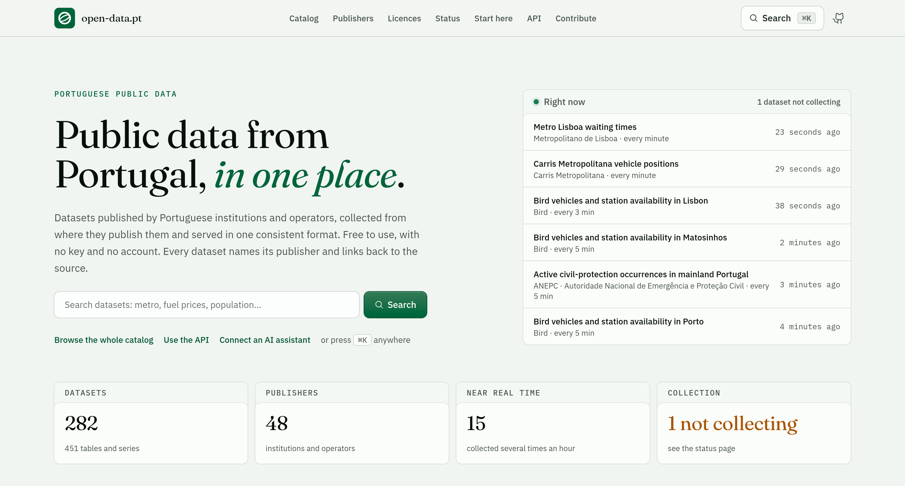

# open-data.pt

Portuguese public data, collected from wherever each institution publishes it and served as one
consistent, cacheable JSON API and a web catalog. Free to use, with no key and no account. Every
dataset names its publisher, states its licence, and links back to the source.

[](https://open-data.pt)

[**Catalog**](https://open-data.pt) · [Publishers](https://open-data.pt/publisher/) ·
[Licences](https://open-data.pt/licence/) · [Status](https://open-data.pt/status/) ·
[API reference](https://open-data.pt/docs) · [OpenAPI](https://open-data.pt/openapi.json) ·
[MCP server](https://open-data.pt/mcp)

```bash
curl "https://open-data.pt/api/products"
curl "https://open-data.pt/api/products/ipma-forecast-daily/records?limit=5"
```

## How it works

A source is read by one **library** — a format (GTFS, CKAN, ArcGIS, …) or one bespoke API (IPMA, REN,
Parliament, …) — inside a single Gatekeeper Worker, which returns a normalized stream and nothing
else. The kernel turns that stream into **products**: it detects what actually changed, keeps the
meaningful revisions as history, serves the current version from content-addressed chunks, and caches
every answer at the edge. Source bodies never leave the Gatekeeper, and the API is read-only.

[Architecture](docs/architecture.md) has the whole path, with the diagram.

## Documentation

| Page                                 | What it answers                                                   |
| ------------------------------------ | ----------------------------------------------------------------- |
| [Architecture](docs/architecture.md) | How a source becomes a product, and where everything is stored    |
| [Libraries](docs/libraries.md)       | What the Gatekeeper reads, and which sources are held back        |
| [Public API](docs/api.md)            | Every endpoint and the rules that apply to all of them            |
| [Running it](docs/development.md)    | Local development, the checks, and what a deployment does         |
| [Publishers](docs/publishers/)       | Per-publisher notes: access, credentials, quirks, permissions     |
| [Feeds](docs/feeds/)                 | How a feed is defined, and notes on the ones that need explaining |
| [CONTRIBUTING.md](CONTRIBUTING.md)   | Adding a dataset, a source or a format                            |
| [CONTEXT.md](CONTEXT.md)             | The domain language, term by term                                 |
| [AGENTS.md](AGENTS.md)               | The same rules, for coding agents                                 |

## Running it locally

```bash
pnpm install
pnpm types
pnpm dev                 # the kernel and the Gatekeeper, carrying every library
pnpm dev -- ckan         # carrying CKAN alone, so only its feeds are installed and polled
```

Nothing has to be installed by hand: the Registry installs every example feed the Gatekeeper lists and
keeps them in sync. [Running it](docs/development.md) covers the checks, live-source testing and
deployment.

## Contributing

Adding a dataset from a source already read is one entry in a library's `examples.ts`; a new source on
a known format is that entry plus a hostname. [CONTRIBUTING.md](CONTRIBUTING.md) walks through all four
kinds of contribution. Pull requests welcome; deploys and secrets are the owner's.

Something broken or missing? The issue templates cover
[a broken source](.github/ISSUE_TEMPLATE/broken-source.yml) and
[a source to add](.github/ISSUE_TEMPLATE/suggest-source.yml).

## Licence

The code is MIT-licensed; see [`LICENSE`](LICENSE). The data is not: every product belongs to the
institution that published it, under the licence and attribution it names.
