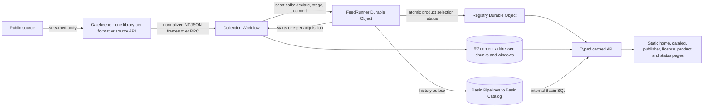

# Architecture

How a public source becomes a cacheable product. The vocabulary used here — Gatekeeper, library,
feed, product, policy, runner, lake — is defined in [`../CONTEXT.md`](../CONTEXT.md).

The API is intentionally unversioned while the platform is in development. Breaking changes are made
in place; there is no legacy protocol or storage compatibility layer.

## The Gatekeeper

One Worker, reached only through a private service binding, carrying every **library**. A library is
how data is read — a format or a bespoke source API — never what the data is about or who publishes
it: topics overlap (a city Wi-Fi map is `cities` and `telecom`), and a publisher may be read two ways
(Carris Metropolitana through its own API and through GTFS). Each library declares in `deployment.ts`
its name, its vars with their values, and any secrets, buckets and CPU limit;
`apps/gatekeeper/src/libraries.ts` lists the ones the Worker carries.
[Libraries](libraries.md) has the full list and the vocabularies the catalog groups by.

The Worker holds no parsing. It builds each library from its declared vars and the Worker's bindings,
and every feed its publisher folders list. Every feed's configuration names its library in `source`,
and that key is what routes it; the library never sees it.

The RPC has three operations: `catalog`, `catalogVersion` and `collect`. The catalog is every feed of
a publisher we may republish, each resolved by its library to its resource key and configuration
digest and carrying its own policy, with the publishers, licences and topics they name; the kernel
installs exactly those feeds, and a feed's configuration never leaves the Gatekeeper.
`catalogVersion` is its digest. A collection names its feed by slug with the configuration digest the
kernel installed; the Gatekeeper reads the feed from its own catalog and answers `feed-changed` when
it holds another configuration. `collect` returns a typed unchanged, batch, exhausted, or failure
result. A batch is one `open-data-normalized/5` NDJSON stream: a header (product declarations,
provenance, and the checkpoint: the normalizer and its source state), product-keyed record and point
frames, and a mandatory completion frame that may finalize values only known at the end (inferred
schema, watermark, a product found absent). The kernel keeps a checkpoint for one configuration and
feed epoch and drops it when either changes. Adapters hand the shared collector a typed source fetch; formats
that can be read row by row (CSV, NDJSON, JSON arrays, GeoJSON features, GTFS ZIP entries) stream,
and everything else is buffered under a 16 MiB cap. Source bodies never leave the Gatekeeper.

## Collection

Each FeedRunner owns one feed's schedule and state, and starts one Workflow instance per acquisition.
Waiting on sources, R2 and Pipelines is billed as Workflow CPU and steps, not Durable Object
duration. A runner has no idle wake-up: its alarm is the next thing it has to do, so a weekly feed
sleeps for a week. The Workflow consumes the stream frame by frame with bounded memory:

1. The runner binds the batch's products to durable slugs and versions.
2. Record products up to 20,000 rows are compared in memory against the rows they currently serve;
   larger products are compared chunk by chunk against a SQLite entity index in the runner, which
   writes only changed rows.
3. Changed products are served from content-addressed chunks, listed in order on the product's index
   entry. Rows are ordered by entity key and chunks end where a key's hash says so, so one change
   rewrites one chunk and unchanged chunks are never uploaded again.
4. Meaningful revisions become history rows in a runner outbox, about one megabyte per SQLite row.
5. One transaction applies staged entity changes, commits the outbox, and advances the checkpoint.
   The Registry then selects every current product of the feed at once; publication is retried until
   it succeeds.
6. When the collection committed history, the Workflow delivers the outbox to Pipelines; whatever it
   leaves behind, the runner's alarm drains ten minutes later.

A collection that fails before commit leaves nothing behind and is retried from the source. Permanent
failures, and three consecutive executor interruptions (memory or CPU kills), put the feed in a
cooldown (6 hours, doubling to 48) after which the same acquisition retries by itself; a gatekeeper
update that changes the feed clears the cooldown at once. Nobody has to resume anything. Undelivered
history is visible as the feed's `historyBacklog`; new collections pause above the kernel's backlog
budget, and accepted history is never deleted to relieve pressure.

## Storage

- **Durable Object SQLite:** feed definitions with their policies, the product index with each record product's
  chunk list, status and recent activity (Registry); schedule, checkpoint, product entries, the
  entity index of large products, staged changes, the history outbox and acquisitions (each
  FeedRunner).
- **R2 `open-data-pt-data`:** content-addressed record chunks and bounded series and change windows.
  Only the selected version is served: whatever the previous version referenced and the new one does
  not is deleted an hour later.
- **Basin Catalog:** durable `open_data.records` and `open_data.points` revision history written
  through Basin Pipelines, partitioned by ingest day, compacted, with snapshots kept for a week.

There is no raw source archive, no pending-batch store, no acquisitions history table, and no
application usage ledger.

## History and backfill

A library with a source-supported history capability uses the same `collect` operation with a history
cursor. Backfill slices go to the lake only, persist their cursor, keep knowledge time distinct from
event time, and never change current serving. They are paced twice: the kernel spaces the slices of
every feed read by one library (at least 20 seconds, more as more of them walk at once), and never
reads one feed's slices faster than its feed kind's `history.minSliceSeconds` says the source can take
— five minutes for SNIRH's station exports, twenty seconds for a statistics API.

Public history is typed and requires bounded UTC intervals (at most 366 days); the endpoints are in
[the API reference](api.md#history). Queries skip ingest-day partitions before the window whenever
that is safe (knowledge-time ranges, and event or observation feeds). Windows that ended more than an
hour ago are cached at the edge for a day. Responses include an opaque `nextCursor`, freshness, and
explicit coverage. There is no anonymous arbitrary-SQL endpoint.

A daily Registry audit compares a sample of yesterday's committed history row counts with the lake;
the result is logged as a `lake_audit` event, and a mismatch or a failed check as an error.

## The site

The pages come from `apps/site`, a Vite and React build on Cloudflare's Kumo components;
`pnpm build:site` writes them to `apps/site/dist`, which the kernel serves as static assets, and
`pnpm deploy:kernel` builds them first. They fetch on initial load, explicit refresh, and visibility
restoration. They do not open WebSockets or continuously poll.

The MCP server at `/mcp` is built with Cloudflare Code Mode (`apps/kernel/src/api/mcp.ts`): a `search`
tool over the OpenAPI document and an `execute` tool against the API, each run in a Dynamic Worker
with no network access.

Every page also carries the site's agent, a panel in the corner that answers questions about the
data and draws charts, maps and tables. It is a second consumer of the MCP server: the same
`openApiMcpServer`, with the same `search` and `execute` tools and the same guide
(`packages/api/src/mcp.ts`), runs inside the visitor's browser (`apps/site/src/lib/ask.ts`). The
model's code runs in Code Mode's `IframeSandboxExecutor`, an `allow-scripts` iframe whose CSP allows
no network, instead of on a Dynamic Worker, and its `codemode.request()` reads `/api` from the page.
Only there does the code also get `ui.chart`, `ui.map` and `ui.table`; `/mcp` offers assistants
exactly what it did before.

The model runs on the visitor's own Cloudflare account. They sign in with Cloudflare, an OAuth 2.0
authorization code flow with PKCE against a public client, and grant `ai.read`, `ai.write`, `memberships.read` (so the agent can list their
accounts) and `offline_access`; sign-in returns them to the page they started from with the agent open. The
browser runs the conversation and sends each model step to `POST /ask/chat`, which passes it to the
visitor's Workers AI (`/ai/v1/chat/completions`, streamed) with their token
(`apps/kernel/src/ask/ask.ts`). It passes through only because Cloudflare's API answers no browser
preflight. The tokens live in an httpOnly cookie, which Workers Logs records as `REDACTED`; the
kernel stores nothing and pays for no inference and no code run. `GET /ask/session` answers from the
cookie alone, since every page asks it; the conversation is kept in the tab's `sessionStorage`, so
it follows the visitor from page to page.

Cloudflare's own chat agent class, `AIChatAgent`, was the alternative. It would keep each
conversation in a Durable Object on our account over a WebSocket, and its code runs would be
Dynamic Workers we pay for.

The OAuth client is the owner's to create, once, as a **public** client of the account (making a
client public cannot be undone, and needs the domain verified). Its scopes are the three above and
its redirect URIs are `https://open-data.pt/ask/callback` and `http://localhost:8787/ask/callback`.
Its ID goes in `ASK_OAUTH_CLIENT_ID` in the kernel's `wrangler.jsonc`; it is not a secret. While that
is empty the agent does not appear. `pnpm dev` runs the kernel with
`--local-upstream localhost:<port>`, so a local sign-in comes back to the local kernel.
